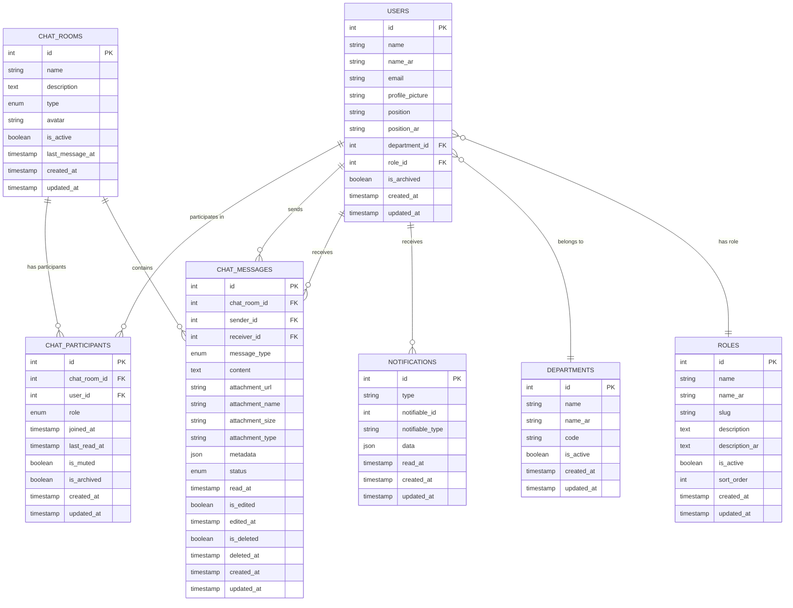

# مخطط قاعدة البيانات - نظام الدردشة الداخلية

## Entity Relationship Diagram (ERD)



## وصف الجداول

### 1. USERS (المستخدمون)
جدول المستخدمين الرئيسي في النظام، يحتوي على معلومات الموظفين.

**المفاتيح الأساسية:**
- `id`: المعرف الفريد للمستخدم
- `name`: الاسم بالإنجليزية
- `name_ar`: الاسم بالعربية
- `email`: البريد الإلكتروني
- `profile_picture`: صورة الملف الشخصي
- `position`: المنصب بالإنجليزية
- `position_ar`: المنصب بالعربية

**العلاقات:**
- ينتمي إلى قسم واحد (DEPARTMENTS)
- له دور واحد (ROLES)
- يمكن أن يشارك في عدة دردشات (CHAT_PARTICIPANTS)
- يمكن أن يرسل ويستقبل رسائل (CHAT_MESSAGES)
- يمكن أن يستقبل إشعارات (NOTIFICATIONS)

### 2. CHAT_ROOMS (غرف الدردشة)
جدول غرف الدردشة، يحتوي على معلومات الدردشات.

**المفاتيح الأساسية:**
- `id`: المعرف الفريد للدردشة
- `name`: اسم الدردشة
- `description`: وصف الدردشة
- `type`: نوع الدردشة (private/group)
- `avatar`: صورة الدردشة
- `is_active`: حالة الدردشة
- `last_message_at`: وقت آخر رسالة

**العلاقات:**
- تحتوي على عدة رسائل (CHAT_MESSAGES)
- لها عدة مشاركين (CHAT_PARTICIPANTS)

### 3. CHAT_MESSAGES (الرسائل)
جدول الرسائل، يحتوي على جميع الرسائل المرسلة في الدردشات.

**المفاتيح الأساسية:**
- `id`: المعرف الفريد للرسالة
- `chat_room_id`: معرف الدردشة
- `sender_id`: معرف المرسل
- `receiver_id`: معرف المستقبل
- `message_type`: نوع الرسالة (text/image/file/contact/system)
- `content`: محتوى الرسالة
- `attachment_url`: رابط المرفق
- `attachment_name`: اسم المرفق
- `attachment_size`: حجم المرفق
- `attachment_type`: نوع المرفق
- `metadata`: بيانات إضافية (JSON)
- `status`: حالة الرسالة (sent/delivered/read)
- `read_at`: وقت القراءة
- `is_edited`: تم التعديل
- `edited_at`: وقت التعديل
- `is_deleted`: تم الحذف
- `deleted_at`: وقت الحذف

**العلاقات:**
- تنتمي إلى دردشة واحدة (CHAT_ROOMS)
- لها مرسل واحد (USERS)
- لها مستقبل واحد (USERS)

### 4. CHAT_PARTICIPANTS (المشاركون)
جدول المشاركين في الدردشات، يربط المستخدمين بالدردشات.

**المفاتيح الأساسية:**
- `id`: المعرف الفريد للمشاركة
- `chat_room_id`: معرف الدردشة
- `user_id`: معرف المستخدم
- `role`: دور المشارك (admin/member)
- `joined_at`: وقت الانضمام
- `last_read_at`: آخر قراءة
- `is_muted`: كتم الصوت
- `is_archived`: أرشفة

**العلاقات:**
- ينتمي إلى دردشة واحدة (CHAT_ROOMS)
- ينتمي إلى مستخدم واحد (USERS)

### 5. NOTIFICATIONS (الإشعارات)
جدول الإشعارات، يحتوي على جميع الإشعارات المرسلة للمستخدمين.

**المفاتيح الأساسية:**
- `id`: المعرف الفريد للإشعار
- `type`: نوع الإشعار
- `notifiable_id`: معرف المستخدم
- `notifiable_type`: نوع المستخدم
- `data`: بيانات الإشعار (JSON)
- `read_at`: وقت القراءة

**العلاقات:**
- ينتمي إلى مستخدم واحد (USERS)

## الفهارس (Indexes)

### فهارس الأداء
```sql
-- فهارس CHAT_MESSAGES
CREATE INDEX idx_chat_messages_room_created ON chat_messages(chat_room_id, created_at);
CREATE INDEX idx_chat_messages_sender_created ON chat_messages(sender_id, created_at);
CREATE INDEX idx_chat_messages_receiver_created ON chat_messages(receiver_id, created_at);
CREATE INDEX idx_chat_messages_type_status ON chat_messages(message_type, status);

-- فهارس CHAT_PARTICIPANTS
CREATE UNIQUE INDEX idx_chat_participants_room_user ON chat_participants(chat_room_id, user_id);
CREATE INDEX idx_chat_participants_user_archived ON chat_participants(user_id, is_archived);
CREATE INDEX idx_chat_participants_room_role ON chat_participants(chat_room_id, role);

-- فهارس CHAT_ROOMS
CREATE INDEX idx_chat_rooms_type_active ON chat_rooms(type, is_active);
CREATE INDEX idx_chat_rooms_last_message ON chat_rooms(last_message_at);
```

## القيود (Constraints)

### قيود التكامل
```sql
-- قيود المفاتيح الخارجية
ALTER TABLE chat_messages ADD CONSTRAINT fk_chat_messages_room 
    FOREIGN KEY (chat_room_id) REFERENCES chat_rooms(id) ON DELETE CASCADE;

ALTER TABLE chat_messages ADD CONSTRAINT fk_chat_messages_sender 
    FOREIGN KEY (sender_id) REFERENCES users(id) ON DELETE CASCADE;

ALTER TABLE chat_messages ADD CONSTRAINT fk_chat_messages_receiver 
    FOREIGN KEY (receiver_id) REFERENCES users(id) ON DELETE CASCADE;

ALTER TABLE chat_participants ADD CONSTRAINT fk_chat_participants_room 
    FOREIGN KEY (chat_room_id) REFERENCES chat_rooms(id) ON DELETE CASCADE;

ALTER TABLE chat_participants ADD CONSTRAINT fk_chat_participants_user 
    FOREIGN KEY (user_id) REFERENCES users(id) ON DELETE CASCADE;

-- قيود فريدة
ALTER TABLE chat_participants ADD CONSTRAINT uk_chat_participants_room_user 
    UNIQUE (chat_room_id, user_id);
```

## تحسينات الأداء

### 1. التقسيم (Partitioning)
```sql
-- تقسيم جدول الرسائل حسب التاريخ
CREATE TABLE chat_messages_2024 PARTITION OF chat_messages
    FOR VALUES FROM ('2024-01-01') TO ('2025-01-01');

CREATE TABLE chat_messages_2025 PARTITION OF chat_messages
    FOR VALUES FROM ('2025-01-01') TO ('2026-01-01');
```

### 2. الضغط (Compression)
```sql
-- ضغط البيانات القديمة
ALTER TABLE chat_messages SET (compression = 'zstd');
```

### 3. التنظيف الدوري
```sql
-- حذف الرسائل المحذوفة القديمة
DELETE FROM chat_messages 
WHERE is_deleted = true 
AND deleted_at < NOW() - INTERVAL '1 year';
```

## الأمان

### 1. تشفير البيانات الحساسة
```sql
-- تشفير محتوى الرسائل
ALTER TABLE chat_messages 
ADD COLUMN content_encrypted BYTEA;

-- تشفير المرفقات
ALTER TABLE chat_messages 
ADD COLUMN attachment_encrypted BYTEA;
```

### 2. تدوير المفاتيح
```sql
-- جدول مفاتيح التشفير
CREATE TABLE encryption_keys (
    id SERIAL PRIMARY KEY,
    key_id VARCHAR(50) UNIQUE NOT NULL,
    key_data BYTEA NOT NULL,
    created_at TIMESTAMP DEFAULT NOW(),
    is_active BOOLEAN DEFAULT TRUE
);
```

## النسخ الاحتياطي

### 1. النسخ الاحتياطي الكامل
```bash
# نسخ احتياطي يومي
pg_dump -h localhost -U username -d database_name > backup_$(date +%Y%m%d).sql
```

### 2. النسخ الاحتياطي التفاضلي
```bash
# نسخ احتياطي للرسائل الجديدة فقط
pg_dump -h localhost -U username -d database_name \
    --table=chat_messages \
    --where="created_at > '$(date -d '1 day ago' '+%Y-%m-%d')'" \
    > messages_backup_$(date +%Y%m%d).sql
```

## المراقبة

### 1. مراقبة الأداء
```sql
-- استعلامات بطيئة
SELECT query, mean_time, calls 
FROM pg_stat_statements 
WHERE mean_time > 1000 
ORDER BY mean_time DESC;
```

### 2. مراقبة المساحة
```sql
-- حجم الجداول
SELECT 
    schemaname,
    tablename,
    pg_size_pretty(pg_total_relation_size(schemaname||'.'||tablename)) as size
FROM pg_tables 
WHERE schemaname = 'public'
ORDER BY pg_total_relation_size(schemaname||'.'||tablename) DESC;
```

---

هذا المخطط يوضح البنية الكاملة لقاعدة بيانات نظام الدردشة الداخلية مع جميع العلاقات والقيود والفهارس المطلوبة لضمان الأداء الأمثل والأمان الكامل.
